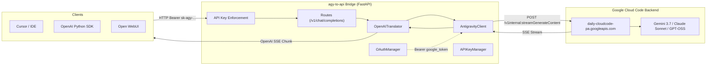

# Developer & AI Agent Guide (`AGENTS.md`)

This guide is intended for AI coding agents and human developers maintaining, debugging, or extending the **`agy-to-api`** bridge codebase.

---

## 1. Project Purpose & Architecture

`agy-to-api` translates the internal Google Cloud Code / Jetski API utilized by the **Antigravity CLI (`agy`)** into standard **OpenAI API Schema** (`/v1/chat/completions`, `/v1/models`, `/v1/completions`, `/v1/embeddings`).

### Data Flow Diagram



---

## 2. Directory Layout & Key Modules

```
agy-to-api/
├── app/
│   ├── config.py             # Constants, URLs, model aliases, OAuth client IDs
│   ├── auth.py               # Google OAuth 2.0 PKCE flow, secret-tool auto-import, token refresh
│   ├── keys.py               # Bridge API key registry, generation, revocation, and enforcement
│   ├── client.py             # HTTP client for Google backend (streamGenerateContent, fetchModels, quotas)
│   ├── translator.py         # OpenAI <-> Google internal schema converter, thinking tokens, tools
│   ├── routes/
│   │   ├── openai.py         # /v1/chat/completions, /v1/models, /v1/completions, /v1/embeddings
│   │   ├── auth_routes.py    # /auth/login, /auth/callback, /auth/status, /auth/refresh, /auth/logout
│   │   └── dashboard.py      # Web dashboard, /api/keys, /api/quotas, /health
│   └── templates/
│       └── dashboard.html    # Interactive dashboard & API key management
├── data/                     # Local persistence directory (credentials.json, api_keys.json)
├── tests/                    # Unit and integration test suite
│   ├── test_api_endpoints.py
│   ├── test_api_keys.py
│   ├── test_auth.py
│   └── test_translator.py
├── test_large_prompt.py      # 500k+ token benchmark & needle-in-a-haystack verification script
├── Dockerfile                # Production multi-stage container
├── docker-compose.yml        # Docker Compose configuration
├── pyproject.toml            # Package definition & pytest config
├── requirements.txt          # Production dependencies
├── main.py                   # Server CLI entrypoint & FastAPI launcher
├── README.md                 # User documentation
├── INTERNAL_API.md           # Internal Google API reverse-engineering reference
└── AGENTS.md                 # This guide
```

---

## 3. Core Subsystems

### 3.1 Authentication (`app/auth.py`)
- **OAuth Manager**: Handles PKCE flow with official Google Cloud Code client identity.
- **Keyring Discovery**: On Linux systems with `agy` installed, automatically extracts tokens from `secret-tool` / DBus (`service: gemini, username: antigravity`).
- **Token Refresh**: Automatically checks token expiry and triggers a refresh using Google's OAuth token endpoint (`oauth2.googleapis.com/token`).
- **Persistence**: Persists tokens to `data/credentials.json`.

### 3.2 API Key Management (`app/keys.py`)
- Manages client access tokens (`sk-agy-...`) protecting the bridge.
- Enforces Bearer auth on all `/v1/*` routes when `enforce_keys` is `True`.
- Returns standard OpenAI 401 error payloads on authentication failure.

### 3.3 Internal Client (`app/client.py`)
- Discovers `cloudaicompanionProject` dynamically via `/v1internal:loadCodeAssist`.
- Issues SSE streaming POST requests to `/v1internal:streamGenerateContent?alt=sse`.
- Contains **automatic 401 retry resilience**: If Google returns 401 `UNAUTHENTICATED`, it immediately calls `auth.refresh_access_token()` and retries the request seamlessly.

### 3.4 Translator (`app/translator.py`)
- **Model Resolution**: Maps OpenAI model names and aliases (`gpt-4o`, `claude-3-7-sonnet`, `o1`) to Google internal model identifiers.
- **Content Translation**: Converts OpenAI multi-turn messages (including `"system"` and `"developer"` roles), multimodal image and audio data (`image_url`, `input_audio`), and tool definitions into Google's `contents`, `systemInstruction`, and `tools` schema.
- **Structured Outputs & Response Formats**: Translates `response_format: {"type": "json_object"}` and `{"type": "json_schema", ...}` into `responseMimeType: "application/json"` and `responseSchema`.
- **Advanced Generation Controls**: Handles `stop` sequences, `presence_penalty`, `frequency_penalty`, `seed`, and candidate count `n`.
- **Tool Choice Mapping**: Maps `tool_choice` (`"auto"`, `"none"`, `"required"`, specific function) to `toolConfig.functionCallingConfig`.
- **Thinking / Reasoning Tokens**: Extracts thought tokens (`part["thought"] == True`) and maps them to `delta.reasoning_content` in OpenAI chunks.
- **Token Usage & Caching Reporting**: Formats Google `usageMetadata` into OpenAI `usage` (including `prompt_tokens_details.cached_tokens` and `completion_tokens_details.reasoning_tokens`) and handles `stream_options.include_usage`.
- **Tool Calling & Thought Signatures**: Caches and restores `thoughtSignature` across multi-turn function calls to satisfy Gemini's strict signature requirement.

### 3.5 Web Dashboard & UI (`app/templates/dashboard.html`, `app/routes/dashboard.py`)
- **Header Layout**: Top navbar displays the service identity and a center interactive Base URL button (copies the endpoint URL to clipboard on click).
- **Multi-Backend Providers Card Grid**: Integrates controls, toggles, and status for Google Cloud Code / Antigravity OAuth, official Google Gemini AI Studio API keys, and Gemini Web session cookies. All backends are disabled by default.
- **Available Models Catalog**: Displays available models from currently enabled backends in an API-key-styled dense table with clickable Model IDs (click to copy), context window sizes, designated capability emojis (`🧠` Reasoning, `🛠️` Tools, `👁️` Multimodal, `🔢` Embeddings with a capability legend), and provider availability checkmarks.
- **Quota Monitoring & Key Management**: Visual gauges for quota usage and full UI for generating, inspecting, revoking bridge API keys, and toggling enforcement.
- **Toast Feedback System**: Non-blocking animated pill toasts for clipboard copying, token refresh events, and status updates.
- **Consistent Styling**: All UI elements (cards, buttons, inputs, tables, badges, toast notifications, code snippets, dialogs) strictly use daisyUI components and Tailwind CSS utility classes without custom CSS overrides.

---

## 4. Development & Testing Commands

### Virtual Environment Setup
```bash
python3 -m venv .venv
source .venv/bin/activate
pip install -r requirements.txt
```

### Linting & Formatting (CRITICAL)
**Do not commit any code until it passes a perfect `ruff` check.** All files must adhere strictly to the project's formatting and linting rules.

```bash
# Run ruff linter to check for errors
ruff check .

# Automatically fix fixable linting errors
ruff check . --fix

# Format code to standard style
ruff format .
```

### Running Unit & Integration Tests
```bash
# Source the virtual environment and run all pytest suites using uv
source .venv/bin/activate
uv run pytest -v
```

### Running the Server Locally
```bash
# Start on default port 8000
python main.py --port 8000

# Check status
python main.py --status

# Login via CLI in headless mode
python main.py --login
```

### Running 500k+ Token Benchmark
```bash
# Verify large context handling & needle retrieval
python test_large_prompt.py
```

### Building & Testing Docker Container
```bash
# Build image
docker build -t agy-to-api:latest .

# Run container
docker run -d --rm -p 8081:8000 -v $(pwd)/data:/app/data --name agy-dev agy-to-api:latest

# Healthcheck
curl http://localhost:8081/health

# Stop container
docker stop agy-dev
```

---

## 5. Critical Constraints & Gotchas

### 1. Model Output Token Limits
- **Claude Models (`claude-sonnet-4-6`, `claude-opus-4-6-thinking`)**: Maximum allowed `maxOutputTokens` is **`64,000`**. Passing higher values (e.g. `65,536`) causes Google's upstream proxy to return `400 INVALID_ARGUMENT`.
- **GPT-OSS Models (`gpt-oss-120b-medium`)**: Maximum `maxOutputTokens` is **`32,768`**.
- **Gemini Models (`gemini-3.7-flash-high`)**: Maximum `maxOutputTokens` is **`65,536`**.
- **Translator Rule**: Always cap `maxOutputTokens` to the specific model limit in `app/translator.py`.

### 2. Claude Thinking Config
- Claude models require `thinkingBudget >= 1024` if `thinkingConfig` is supplied. Do not send `-1` (dynamic) for Claude models. If no reasoning effort is specified, omit `thinkingConfig` entirely.

### 3. Thought Signature in Tool Calling
- Gemini models emit a `thoughtSignature` string with function calls. When the client executes the function and returns `role: tool`, the prior model assistant message must include that `thoughtSignature` in the payload sent to Google. `_thought_signature_cache` in `app/translator.py` handles this.

### 4. Headless & Container Deployments
- When running in Docker without desktop keyring access, provide `REFRESH_TOKEN` and `GOOGLE_PROJECT_ID` as environment variables, mount `./data:/app/data` containing `credentials.json`, or log in once via the web dashboard at `/auth/login`.

---

## 6. How to Add a New Model

1. Check available models via `POST /v1internal:fetchAvailableModels` or review [`INTERNAL_API.md`](INTERNAL_API.md).
2. Add the internal model name and desired aliases to `MODEL_ALIASES` in [`app/config.py`](app/config.py).
3. If the model has specific `maxOutputTokens` or `thinkingBudget` limits, add them to `build_internal_request` in [`app/translator.py`](app/translator.py).
4. Run `.venv/bin/pytest -v` to ensure test suite passes.
